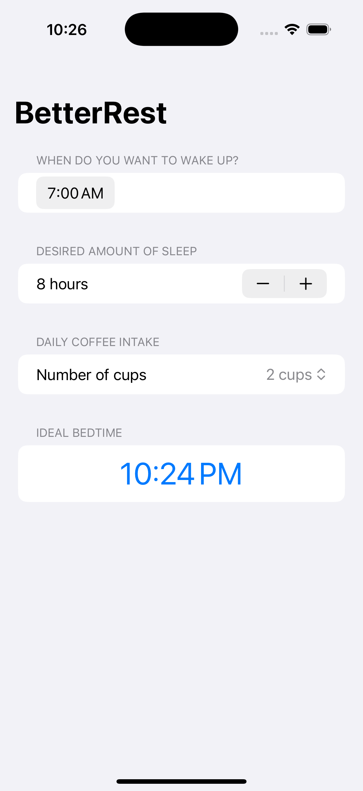
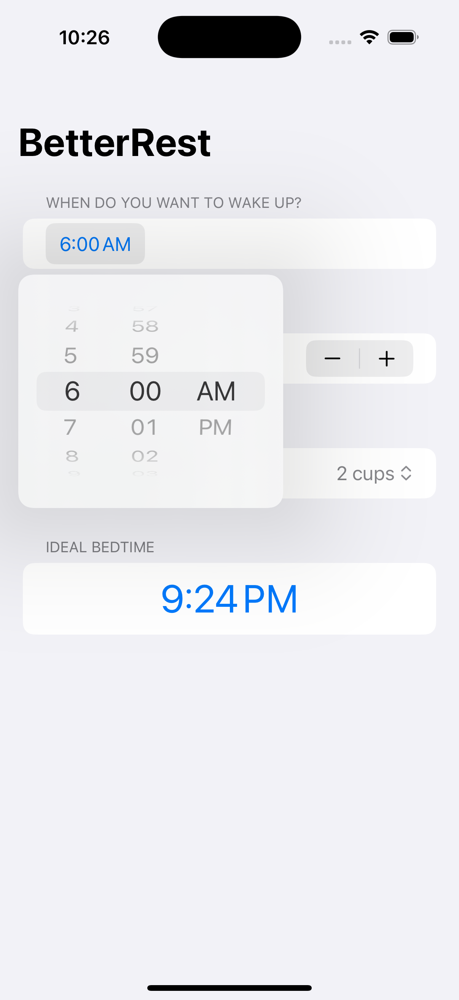
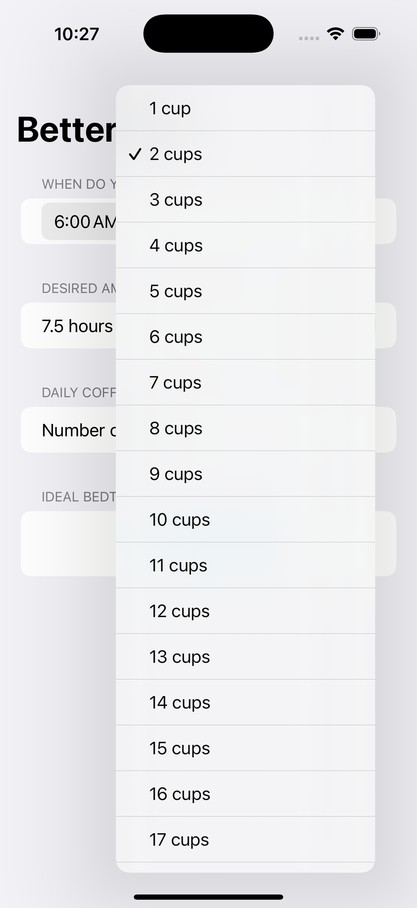

# BetterRest

BetterRest calculates your optimal bedtime based on wakeup time, desired hours of sleep, and coffee consumption using the power of machine learning. The machine learning model was build using Apple's Create ML and Core ML.

